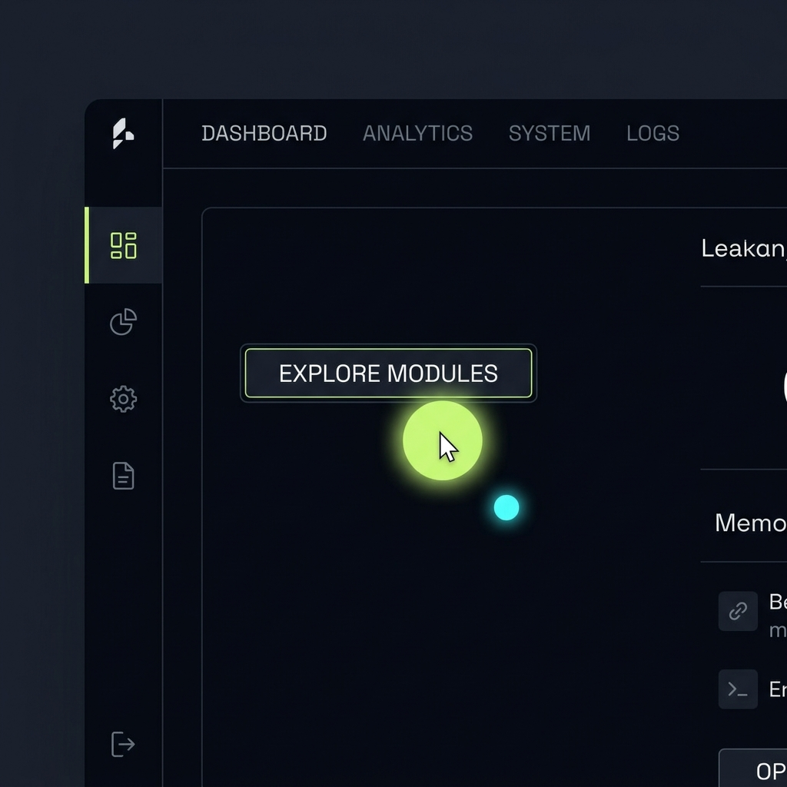

# 01 — Custom Cursor Glow

**Category:** Interaction / Polish  
**Complexity:** ⭐⭐ Medium  
**Dependencies:** None — Pure CSS + Vanilla JS

---

## Preview



*The glow expands and changes to lime green when hovering over buttons/links.*

---

## What It Is

Replaces the browser's default cursor with two custom elements:
1. **Glow ring** — a large, soft radial gradient circle that snaps to mouse position instantly
2. **Trail dot** — a small solid dot that follows with a smooth lag, creating a trailing effect

On interactive elements (`a`, `button`, `[onclick]`), the glow **scales up** and **changes color** from cyan to lime green.

---

## When To Use

- Premium dark-theme websites
- Portfolio / creative sites
- SaaS landing pages where you want to wow users on desktop
- Always **hide on mobile** (pointer device not available)

---

## HTML

```html
<!-- Place these right after <body> opening tag -->
<div id="cursor-glow"></div>
<div id="cursor-trail"></div>
```

---

## CSS

```css
body { cursor: none; }
@media (max-width: 768px) { body { cursor: auto; } }

#cursor-glow {
  position: fixed;
  width: 20px; height: 20px;
  border-radius: 50%;
  background: radial-gradient(circle, rgba(0,229,255,0.8) 0%, rgba(0,229,255,0) 70%);
  pointer-events: none;
  z-index: 9998;
  transform: translate(-50%, -50%);
  transition: width 0.2s, height 0.2s, background 0.2s, opacity 0.3s;
}

#cursor-trail {
  position: fixed;
  width: 6px; height: 6px;
  border-radius: 50%;
  background: #00e5ff;
  pointer-events: none;
  z-index: 9997;
  transform: translate(-50%, -50%);
  opacity: 0.7;
  transition: opacity 0.3s;
}

/* Hide on touch/mobile */
@media (max-width: 768px) {
  #cursor-glow, #cursor-trail { display: none; }
}
```

---

## JavaScript

```js
(function initCursor() {
  const glow  = document.getElementById('cursor-glow');
  const trail = document.getElementById('cursor-trail');
  let mx = -100, my = -100;
  let tx = -100, ty = -100;

  // Glow snaps instantly
  window.addEventListener('mousemove', e => {
    mx = e.clientX; my = e.clientY;
    glow.style.left = mx + 'px';
    glow.style.top  = my + 'px';
  });

  // Trail follows with lerp smoothing
  const animTrail = () => {
    tx += (mx - tx) * 0.15;  // 0.15 = smoothing factor (lower = more lag)
    ty += (my - ty) * 0.15;
    trail.style.left = tx + 'px';
    trail.style.top  = ty + 'px';
    requestAnimationFrame(animTrail);
  };
  animTrail();

  // Scale up + turn lime on interactive elements
  document.querySelectorAll('a, button, [onclick]').forEach(el => {
    el.addEventListener('mouseenter', () => {
      glow.style.width  = '40px';
      glow.style.height = '40px';
      glow.style.background = 'radial-gradient(circle, rgba(57,255,20,0.6) 0%, rgba(57,255,20,0) 70%)';
    });
    el.addEventListener('mouseleave', () => {
      glow.style.width  = '20px';
      glow.style.height = '20px';
      glow.style.background = 'radial-gradient(circle, rgba(0,229,255,0.8) 0%, rgba(0,229,255,0) 70%)';
    });
  });
})();
```

---

## How It Works

1. `mousemove` listener fires on every mouse movement and immediately positions the **glow** element
2. A `requestAnimationFrame` loop runs the **trail dot** with linear interpolation (`lerp`) — `tx += (mx - tx) * factor`
3. The factor `0.15` means it moves 15% of the remaining distance each frame → creates smooth lag
4. Interactive elements get `mouseenter/leave` listeners that update glow size and color

---

## Customization

| Property | How to change |
|---|---|
| Trail smoothing | Change `0.15` — lower = more lag, higher = snappier |
| Glow size (default) | Change `width/height` from `20px` |
| Glow size (hover) | Change the `40px` in `mouseenter` |
| Default color | Change `rgba(0,229,255,...)` (cyan) |
| Hover color | Change `rgba(57,255,20,...)` (lime) |
| Trail size | Change `width/height: 6px` on `#cursor-trail` |

---

## Used In
- [EnergyPoint/index.html](../index.html)
