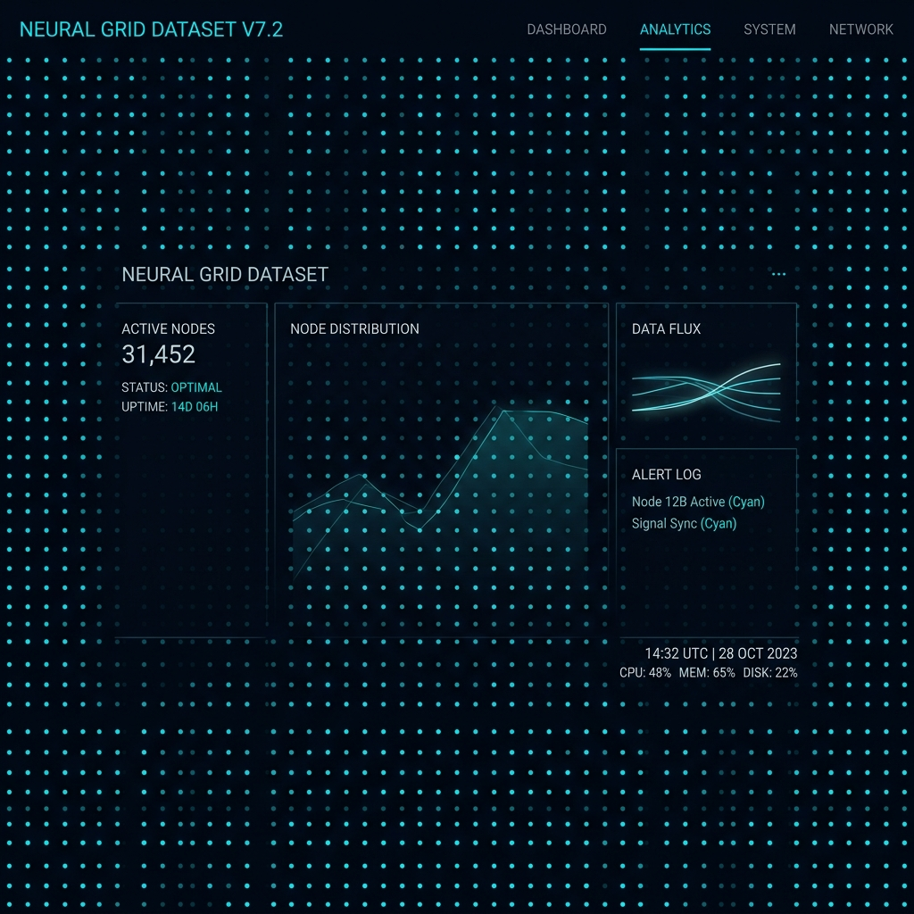

# 03 — Particle Dot Grid Canvas

**Category:** Background / Animation  
**Complexity:** ⭐⭐⭐ High  
**Dependencies:** None — HTML5 Canvas + Vanilla JS

---

## Preview



*Each dot breathes independently at its own speed and phase, creating a living background.*

---

## What It Is

An HTML5 `<canvas>` element that renders a grid of pulsing dots. Each dot has:
- Its own **random base opacity** (so they're not all equal brightness)
- Its own **animation speed** and **phase offset** (so they pulse out of sync)
- Uses `Math.sin` to create smooth breathing oscillation

The canvas automatically **resizes** on window resize.

---

## When To Use

- Hero section backgrounds
- Section dividers
- Login / onboarding screens
- Any dark background that needs depth without complexity

---

## HTML

```html
<!-- Place this inside your hero/section container -->
<div class="hero" style="position: relative; overflow: hidden;">
  <canvas id="hero-canvas"></canvas>
  <!-- your content goes above the canvas via z-index -->
  <div class="hero-content" style="position: relative; z-index: 1;">
    ...
  </div>
</div>
```

---

## CSS

```css
/* The canvas must fill its parent absolutely */
#hero-canvas {
  position: absolute;
  inset: 0;         /* top:0; right:0; bottom:0; left:0 */
  pointer-events: none;
  z-index: 0;       /* behind content */
  width: 100%;
  height: 100%;
}
```

---

## JavaScript

```js
(function initParticles() {
  const canvas = document.getElementById('hero-canvas');
  const ctx    = canvas.getContext('2d');
  let W, H, dots;

  // Build a grid of dots based on canvas size
  function buildDots() {
    dots = [];
    const spacing = 44; // px between dots
    const cols = Math.ceil(W / spacing);
    const rows = Math.ceil(H / spacing);

    for (let r = 0; r <= rows; r++) {
      for (let c = 0; c <= cols; c++) {
        dots.push({
          x: c * spacing,
          y: r * spacing,
          baseAlpha: Math.random() * 0.25 + 0.04, // 0.04 – 0.29
          speed:  Math.random() * 0.008 + 0.003,  // variation in pulse speed
          offset: Math.random() * Math.PI * 2,    // random starting phase
        });
      }
    }
  }

  function resize() {
    W = canvas.width  = canvas.offsetWidth;
    H = canvas.height = canvas.offsetHeight;
    buildDots();
  }

  let t = 0;
  function draw() {
    ctx.clearRect(0, 0, W, H);
    t += 0.01; // global time increment

    dots.forEach(d => {
      // sin oscillation: 0.5 + 0.5*sin gives range [0, 1]
      const alpha = d.baseAlpha * (0.5 + 0.5 * Math.sin(t * d.speed * 60 + d.offset));
      ctx.beginPath();
      ctx.arc(d.x, d.y, 1.2, 0, Math.PI * 2);
      ctx.fillStyle = `rgba(0, 229, 255, ${alpha})`;
      ctx.fill();
    });

    requestAnimationFrame(draw);
  }

  resize();
  window.addEventListener('resize', resize);
  draw();
})();
```

---

## How It Works

1. On init and resize, `buildDots()` creates a grid of dot objects spaced 44px apart
2. Each dot stores: `(x, y)` position, `baseAlpha` (max brightness), `speed`, and `offset`
3. Every animation frame, `t` increments by `0.01`
4. Each dot's alpha = `baseAlpha × (0.5 + 0.5 × sin(t×speed×60 + offset))`
   - The sin formula oscillates smoothly between 0 and `baseAlpha`
   - Different `speed` + `offset` values = desynchronized pulsing
5. `ctx.arc()` draws each dot as a small circle

---

## Customization

| Property | Where |
|---|---|
| Dot spacing | Change `44` in `buildDots()` |
| Dot size | Change `1.2` in `ctx.arc(..., 1.2, ...)` |
| Max brightness | Change `0.25 + 0.04` in `baseAlpha` |
| Animation speed | Change `t += 0.01` |
| Dot color | Change `rgba(0, 229, 255, ...)` |
| Connect dots with lines | Add distance check and `ctx.lineTo()` calls |

---

## Used In
- [EnergyPoint/index.html](../index.html) — Hero section background
