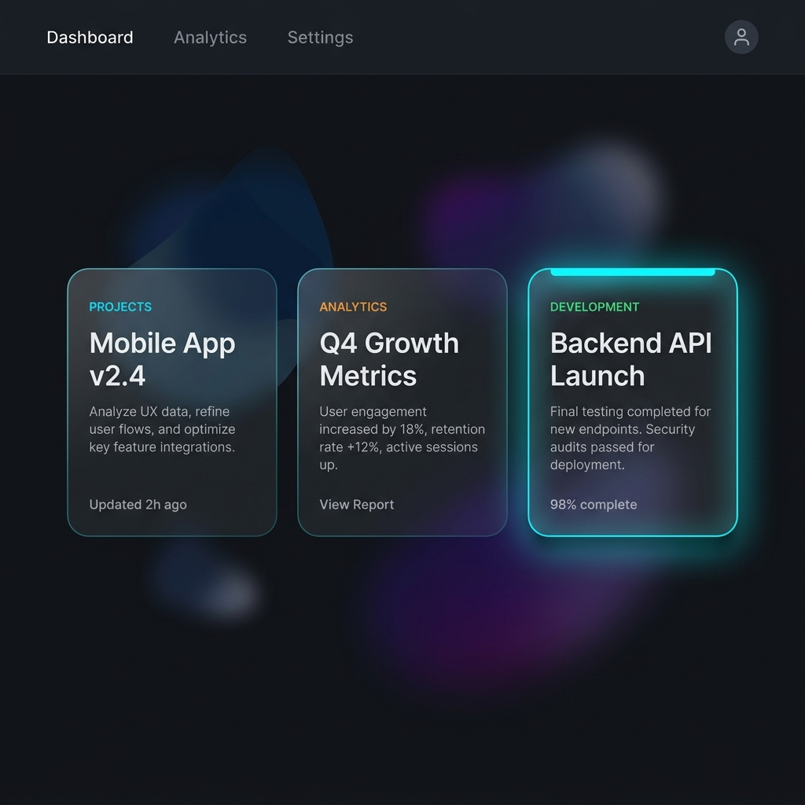

# 06 — Glassmorphism Card

**Category:** UI Component / Layout  
**Complexity:** ⭐ Easy  
**Dependencies:** None — Pure CSS

---

## Preview



*The rightmost card shows the hover state: cyan top accent bar animates in, card lifts.*

---

## What It Is

A card design pattern using **frosted glass** aesthetics:
- Semi-transparent dark background
- `backdrop-filter: blur()` for the glass frosting effect
- Subtle colored border (cyan at low opacity)
- On hover: a glowing **top accent bar** slides in, card lifts slightly

The `.benefit-card` variant adds a `::before` pseudo-element for the top gradient bar.

---

## When To Use

- Feature cards, benefit cards, stat cards
- Pricing tiers
- Dashboard widgets
- Any card grid on a dark background

---

## HTML

```html
<div class="glass-card">
  <div class="card-label">RESIDENTIAL</div>
  <h3 class="card-title">Homes & Villas</h3>
  <p class="card-body">
    Silent, compact, beautiful. 10+ years of backup without ever touching it.
  </p>
</div>
```

---

## CSS

```css
/* Base glass card */
.glass-card {
  background: rgba(10, 15, 30, 0.75);
  backdrop-filter: blur(20px);
  -webkit-backdrop-filter: blur(20px);    /* Safari support */
  border: 1px solid rgba(0, 229, 255, 0.12);
  border-radius: 1.5rem;                  /* 24px */
  padding: 1.75rem;
  position: relative;
  overflow: hidden;                       /* needed for ::before */

  /* Smooth hover transition */
  transition:
    transform 0.3s cubic-bezier(0.23, 1, 0.32, 1),
    border-color 0.3s ease,
    box-shadow 0.3s ease;
}

/* Hover state */
.glass-card:hover {
  transform: translateY(-4px);
  border-color: rgba(0, 229, 255, 0.25);
  box-shadow: 0 16px 32px rgba(0, 0, 0, 0.25);
}

/* Top accent bar (hidden by default, visible on hover) */
.glass-card::before {
  content: '';
  position: absolute;
  top: 0; left: 0; right: 0;
  height: 2px;
  background: linear-gradient(to right, #00e5ff, #39ff14);
  opacity: 0;
  transition: opacity 0.3s ease;
}
.glass-card:hover::before {
  opacity: 1;
}

/* Typography inside card */
.card-label {
  font-size: 0.7rem;
  letter-spacing: 0.15em;
  text-transform: uppercase;
  color: #00e5ff;
  margin-bottom: 0.75rem;
}
.card-title {
  font-size: 1.5rem;
  font-weight: 600;
  letter-spacing: -0.03em;
  margin-bottom: 1rem;
}
.card-body {
  font-size: 0.875rem;
  line-height: 1.6;
  color: rgba(255, 255, 255, 0.6);
}
```

---

## How It Works

1. `background: rgba(...)` with alpha < 1 makes the card semi-transparent
2. `backdrop-filter: blur(20px)` frosts everything behind the card
3. The thin `border` with very low cyan opacity gives it a glowing edge look
4. The `::before` pseudo-element is absolutely positioned at the top, hidden with `opacity: 0`
5. On `:hover`, `::before` fades to `opacity: 1` — the accent bar appears
6. `transform: translateY(-4px)` lifts the card slightly on hover

> [!NOTE]
> `backdrop-filter` requires the parent to have a visible background behind it to look good. Works best on backgrounds with color/texture.

---

## Customization

| Property | Where |
|---|---|
| Blur amount | `backdrop-filter: blur(20px)` — increase for more frosting |
| Border color | `rgba(0, 229, 255, 0.12)` |
| Border opacity on hover | `rgba(0, 229, 255, 0.25)` |
| Lift amount | `translateY(-4px)` |
| Accent bar colors | `linear-gradient(to right, #00e5ff, #39ff14)` |
| Corner radius | `border-radius: 1.5rem` |
| Background transparency | Adjust the alpha (0.75 = 75% opaque) |

---

## Used In
- [EnergyPoint/index.html](../index.html) — Benefits section, Experience Center, Why Lithium
