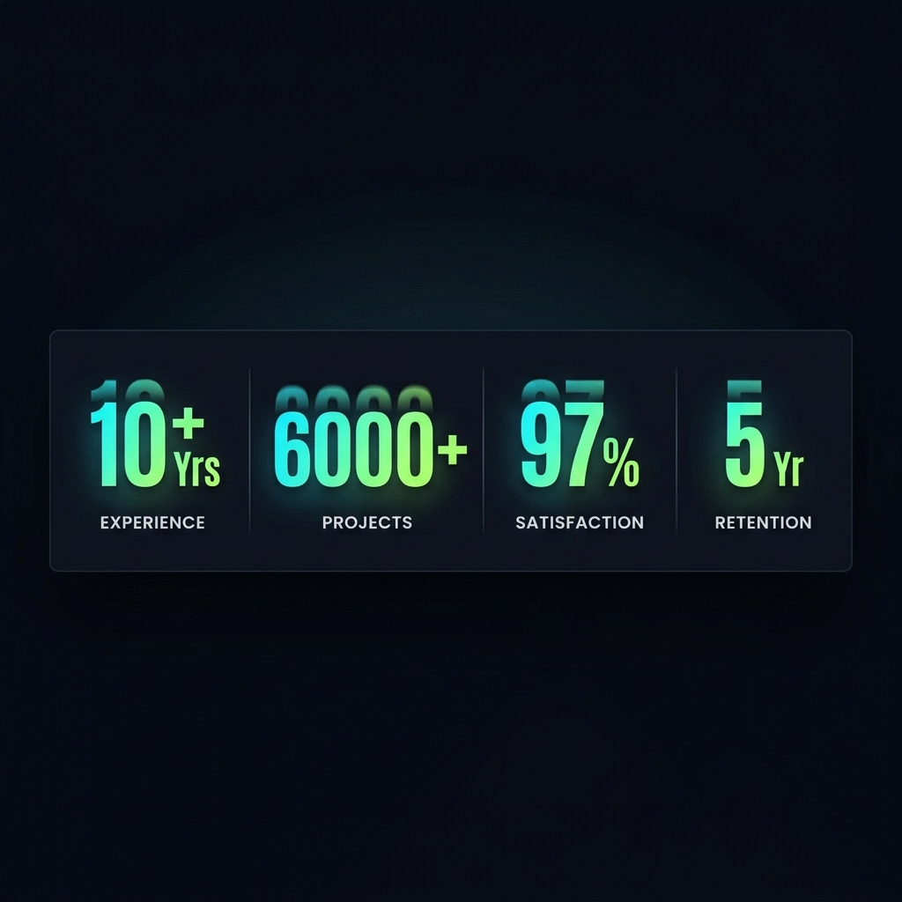

# 07 — Animated Stats Counter

**Category:** Animation / Data Display  
**Complexity:** ⭐⭐ Medium  
**Dependencies:** IntersectionObserver (all modern browsers)

---

## Preview



*Numbers count up from 0 when scrolled into view. Gradient text makes them pop.*

---

## What It Is

Large numbers that **count up from 0** to their target value when they scroll into the viewport. Uses `IntersectionObserver` (no scroll listener needed) and a **cubic easing function** for a satisfying animation.

Numbers have a **cyan-to-lime gradient** text effect using `-webkit-background-clip: text`.

---

## When To Use

- "Social proof" stats sections (clients, cycles, years, etc.)
- Hero supporting stats
- About pages
- Any place you want data to feel alive

---

## HTML

```html
<div class="stats-bar">
  <!-- data-target = the final number -->
  <!-- data-suffix = text appended after the number -->
  <div class="stat-item">
    <div class="stat-number" data-target="10" data-suffix="+ Yrs">0</div>
    <div class="stat-label">DESIGN LIFE</div>
  </div>

  <div class="stats-divider"></div>

  <div class="stat-item">
    <div class="stat-number" data-target="6000" data-suffix="+">0</div>
    <div class="stat-label">CHARGE CYCLES</div>
  </div>

  <div class="stats-divider"></div>

  <div class="stat-item">
    <div class="stat-number" data-target="97" data-suffix="%">0</div>
    <div class="stat-label">EFFICIENCY</div>
  </div>
</div>
```

---

## CSS

```css
.stats-bar {
  display: flex;
  flex-wrap: wrap;
  align-items: center;
  justify-content: center;
  padding: 3rem 1.5rem;
  gap: 2rem;
}

.stat-item {
  text-align: center;
  padding: 0 3rem;
}

/* Gradient text */
.stat-number {
  font-size: clamp(2.5rem, 5vw, 3.5rem);
  font-weight: 700;
  font-variant-numeric: tabular-nums;
  letter-spacing: -0.04em;

  /* The gradient text technique */
  background: linear-gradient(135deg, #00e5ff 0%, #39ff14 100%);
  -webkit-background-clip: text;
  -webkit-text-fill-color: transparent;
  background-clip: text;
}

.stat-label {
  font-size: 0.65rem;
  letter-spacing: 0.2em;
  text-transform: uppercase;
  color: rgba(255, 255, 255, 0.5);
  margin-top: 0.25rem;
}

/* Vertical divider between stats */
.stats-divider {
  width: 1px;
  height: 40px;
  background: linear-gradient(to bottom, transparent, rgba(255,255,255,0.2), transparent);
}

/* Hide dividers on mobile (flex-wrap causes layout issues) */
@media (max-width: 768px) {
  .stats-divider { display: none; }
}
```

---

## JavaScript

```js
function initCounters() {
  const counters  = document.querySelectorAll('.stat-number');

  const observer = new IntersectionObserver((entries) => {
    entries.forEach(entry => {
      if (!entry.isIntersecting) return;

      const el     = entry.target;
      const target = parseInt(el.dataset.target);
      const suffix = el.dataset.suffix || '';
      const start  = Date.now();

      // Duration scales with target size (larger numbers take a bit longer)
      const duration = Math.min(1800, 400 + target * 0.18);

      const update = () => {
        const elapsed  = Date.now() - start;
        const progress = Math.min(elapsed / duration, 1);

        // Cubic ease-out: decelerates toward the end
        const ease     = 1 - Math.pow(1 - progress, 3);
        const current  = Math.round(ease * target);

        el.textContent = current.toLocaleString() + suffix;

        if (progress < 1) requestAnimationFrame(update);
      };

      update();
      observer.unobserve(el); // Only animate once
    });
  }, { threshold: 0.5 }); // Trigger when 50% of element is visible

  counters.forEach(c => observer.observe(c));
}

initCounters();
```

---

## How It Works

1. `IntersectionObserver` watches all `.stat-number` elements
2. When an element becomes 50% visible (`threshold: 0.5`), the animation starts
3. Inside the animation: `progress = elapsed / duration` goes from 0 → 1
4. **Cubic ease-out**: `1 - (1-progress)³` — starts fast, slows down at the end
5. `Math.round(ease × target)` gives the current displayed number
6. `observer.unobserve(el)` ensures it only runs once per element

---

## Customization

| Property | Where |
|---|---|
| Animation duration | `Math.min(1800, 400 + target * 0.18)` — adjust 1800 (max) |
| Trigger threshold | `threshold: 0.5` — 0.5 = 50% visible |
| Easing function | `1 - Math.pow(1 - progress, 3)` — change power for different feel |
| Number formatting | `toLocaleString()` adds commas — remove if unwanted |
| Gradient colors | CSS `background: linear-gradient(...)` |

---

## Used In
- [EnergyPoint/index.html](../index.html) — Stats bar section
