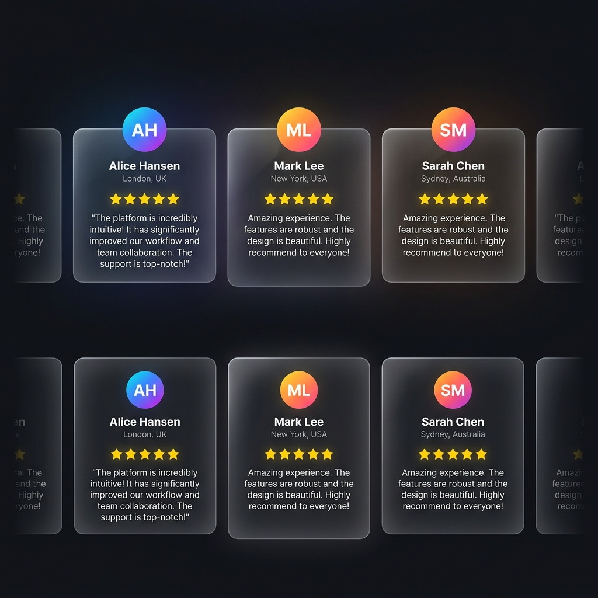

# 09 — Testimonials Auto-Scroll Marquee

**Category:** UI Component / Social Proof  
**Complexity:** ⭐⭐ Medium  
**Dependencies:** None — Pure CSS animation

---

## Preview



*Cards scroll horizontally, pausing on hover. Edges fade to dark.*

---

## What It Is

A horizontally auto-scrolling row of testimonial cards — same marquee technique as the tech strip, but with richer card content:
- **Gradient avatar** circle with initials
- **Name + location**
- **Star rating**
- **Quote text**

Cards respond to hover (lift + cyan border glow).

---

## When To Use

- Social proof / testimonials sections
- Customer reviews
- Featured quotes
- Team member cards

---

## HTML

```html
<section class="testimonials-section">
  <h2>What customers say</h2>

  <div class="marquee-track testimonials-track">
    <!-- COPY 1 -->
    <div class="marquee-content" style="gap: 1.25rem;">
      
      <div class="testimonial-card">
        <div class="t-header">
          <div class="t-avatar" style="background: linear-gradient(135deg, #00e5ff, #39ff14);">AJ</div>
          <div>
            <div class="t-name">Arun Joseph</div>
            <div class="t-location">Thiruvananthapuram • Residential</div>
          </div>
        </div>
        <div class="t-stars">★★★★★</div>
        <p class="t-quote">"Switched from lead-acid 2 years ago. Haven't touched it once."</p>
      </div>

      <!-- Add more cards... -->

    </div>
    <!-- COPY 2 — identical, aria-hidden -->
    <div class="marquee-content" style="gap: 1.25rem; animation-delay: -20s;" aria-hidden="true">
      <!-- same cards repeated -->
    </div>
  </div>
</section>
```

---

## CSS

```css
.testimonials-track {
  display: flex;
  overflow: hidden;
  gap: 1.25rem;
  mask-image: linear-gradient(to right, transparent 0%, black 8%, black 92%, transparent 100%);
  -webkit-mask-image: linear-gradient(to right, transparent 0%, black 8%, black 92%, transparent 100%);
}

.testimonials-track .marquee-content {
  display: flex;
  flex-shrink: 0;
  animation: marquee-scroll 40s linear infinite; /* slower than tech strip */
}
.testimonials-track .marquee-content:nth-child(2) {
  animation-delay: -20s;
}
.testimonials-track:hover .marquee-content {
  animation-play-state: paused;
}

@keyframes marquee-scroll {
  0%   { transform: translateX(0); }
  100% { transform: translateX(-100%); }
}

/* Card */
.testimonial-card {
  flex-shrink: 0;
  width: 320px;
  background: rgba(10, 15, 30, 0.8);
  backdrop-filter: blur(20px);
  border: 1px solid rgba(255, 255, 255, 0.08);
  border-radius: 1.5rem;
  padding: 1.5rem;
  transition: border-color 0.3s, transform 0.3s;
}
.testimonial-card:hover {
  border-color: rgba(0, 229, 255, 0.25);
  transform: translateY(-3px);
}

/* Avatar */
.t-header {
  display: flex; align-items: center; gap: 0.75rem;
  margin-bottom: 1rem;
}
.t-avatar {
  width: 40px; height: 40px; border-radius: 50%;
  display: flex; align-items: center; justify-content: center;
  font-weight: 700; font-size: 0.875rem;
  color: #05070f;
  flex-shrink: 0;
}
.t-name {
  font-weight: 600; font-size: 0.875rem;
}
.t-location {
  font-size: 0.75rem; color: rgba(255,255,255,0.5);
}

/* Stars */
.t-stars {
  color: #fbbf24; /* yellow-400 */
  font-size: 0.75rem;
  margin-bottom: 0.75rem;
}

/* Quote */
.t-quote {
  font-size: 0.875rem;
  line-height: 1.6;
  color: rgba(255, 255, 255, 0.75);
}
```

---

## How It Works

Same infinite marquee technique as the tech strip (see [08-tech-marquee](../08-tech-marquee/README.md)), but:
- **Slower** (40s vs 28s) because cards are wider and need more reading time
- Hover **pauses** the scroll so users can actually read testimonials
- Cards have a fixed `width: 320px` with `flex-shrink: 0` to prevent collapsing

---

## Customization

| Property | Where |
|---|---|
| Scroll speed | `40s` in animation |
| Card width | `width: 320px` on `.testimonial-card` |
| Avatar gradient | `background: linear-gradient(...)` on `.t-avatar` |
| Number of cards | Add more `.testimonial-card` divs (remember to duplicate in COPY 2) |
| Card hover color | `rgba(0, 229, 255, 0.25)` in `:hover` |

---

## Used In
- [EnergyPoint/index.html](../index.html) — Testimonials section
