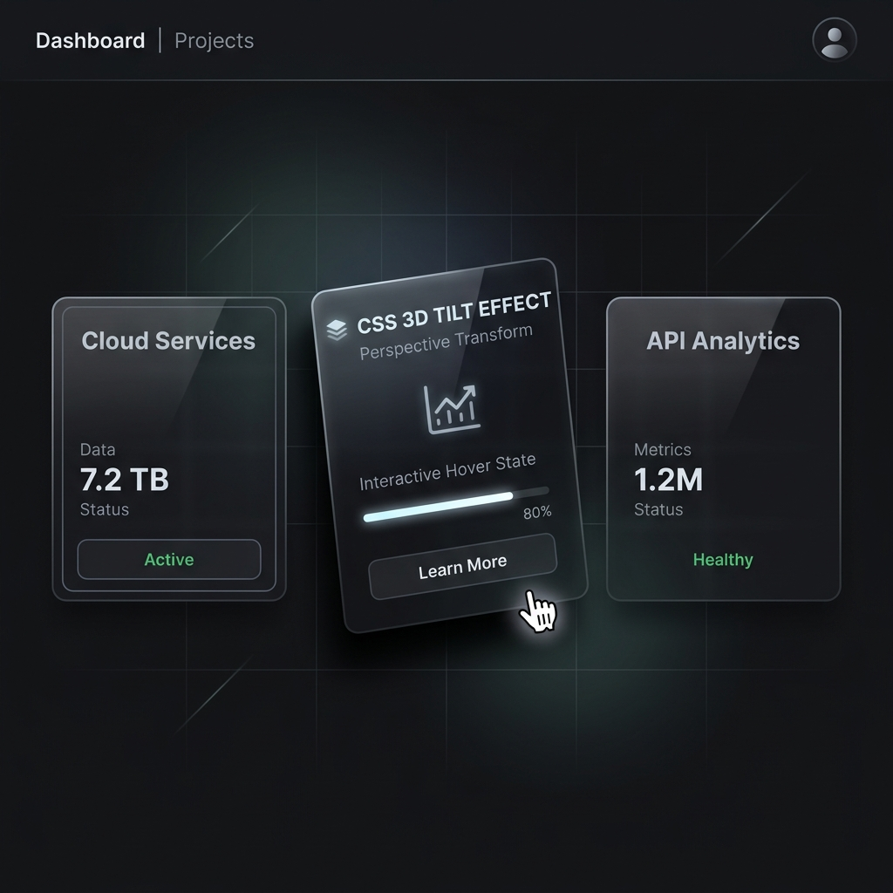

# 10 — 3D Card Tilt on Hover

**Category:** Interaction / Micro-animation  
**Complexity:** ⭐⭐ Medium  
**Dependencies:** None — Pure Vanilla JS + CSS

---

## Preview



*Card tilts toward the mouse cursor using CSS `perspective` transforms.*

---

## What It Is

Cards that **tilt in 3D space** toward the mouse cursor as you move over them. On `mouseleave`, they spring back to flat. Uses CSS `perspective` + JS mouse tracking — no library needed.

---

## When To Use

- Feature / product cards
- Portfolio project cards
- Pricing cards
- Any grid where you want cards to feel interactive and premium

---

## HTML

```html
<div class="tilt-card">
  <div class="card-label">RESIDENTIAL</div>
  <h3>Homes & Villas</h3>
  <p>Silent, compact, 10+ years of backup.</p>
</div>
```

---

## CSS

```css
.tilt-card {
  background: rgba(10, 15, 30, 0.75);
  backdrop-filter: blur(20px);
  border: 1px solid rgba(255, 255, 255, 0.1);
  border-radius: 1.5rem;
  padding: 1.75rem;
  cursor: pointer;

  /* Required for 3D tilt */
  transform-style: preserve-3d;

  /* Smooth return to flat */
  transition:
    transform 0.35s cubic-bezier(0.23, 1, 0.32, 1),
    box-shadow 0.35s cubic-bezier(0.23, 1, 0.32, 1),
    border-color 0.3s ease;
}

/* Hover styles applied via JS — but these handle border/shadow */
.tilt-card:hover {
  box-shadow: 0 20px 40px rgba(0,0,0,0.3), 0 0 25px rgba(0,229,255,0.08);
  border-color: rgba(0, 229, 255, 0.25);
}
```

---

## JavaScript

```js
function initCardTilt() {
  document.querySelectorAll('.tilt-card').forEach(card => {

    card.addEventListener('mousemove', e => {
      const rect = card.getBoundingClientRect();

      // Normalize mouse position to -0.5 → +0.5 range
      const x = (e.clientX - rect.left) / rect.width  - 0.5;
      const y = (e.clientY - rect.top)  / rect.height - 0.5;

      // Apply tilt: 8deg max rotation
      // rotateY tilts left-right, rotateX tilts up-down
      card.style.transform = `
        perspective(600px)
        rotateY(${x * 8}deg)
        rotateX(${-y * 8}deg)
        translateY(-4px)
      `;
    });

    card.addEventListener('mouseleave', () => {
      // The CSS transition handles the smooth return to flat
      card.style.transform = '';
    });

  });
}

initCardTilt();
```

---

## How It Works

1. On `mousemove`, calculate mouse position relative to card:
   - `x = (mouseX - cardLeft) / cardWidth - 0.5` → gives -0.5 to +0.5
   - Same for `y`
2. Multiply by `8` → max rotation angle is 8 degrees
3. Apply `perspective(600px)` — lower value = more dramatic tilt
4. `rotateY` for left-right tilt, `rotateX` for up-down tilt (note the `-y` for natural feel)
5. `translateY(-4px)` lifts the card slightly while tilting
6. On `mouseleave`, clearing `transform` + CSS `transition` → smooth spring-back

---

## Customization

| Property | Where |
|---|---|
| Max tilt angle | Change `8` in `x * 8` and `y * 8` |
| Perspective depth | Change `600px` — lower = more extreme |
| Spring-back speed | Change `0.35s` in the CSS `transition` |
| Lift amount | Change `-4px` in `translateY` |
| Apply to other elements | Change `.tilt-card` selector |

---

## Variants

**Stronger tilt:**
```js
card.style.transform = `perspective(400px) rotateY(${x * 15}deg) rotateX(${-y * 15}deg)`;
```

**Add inner glow that tracks mouse:**
```js
card.style.background = `radial-gradient(circle at ${(x+0.5)*100}% ${(y+0.5)*100}%, rgba(0,229,255,0.08), rgba(10,15,30,0.75))`;
```

---

## Used In
- [EnergyPoint/index.html](../index.html) — Use-case cards (Residential, Commercial, Industrial)
