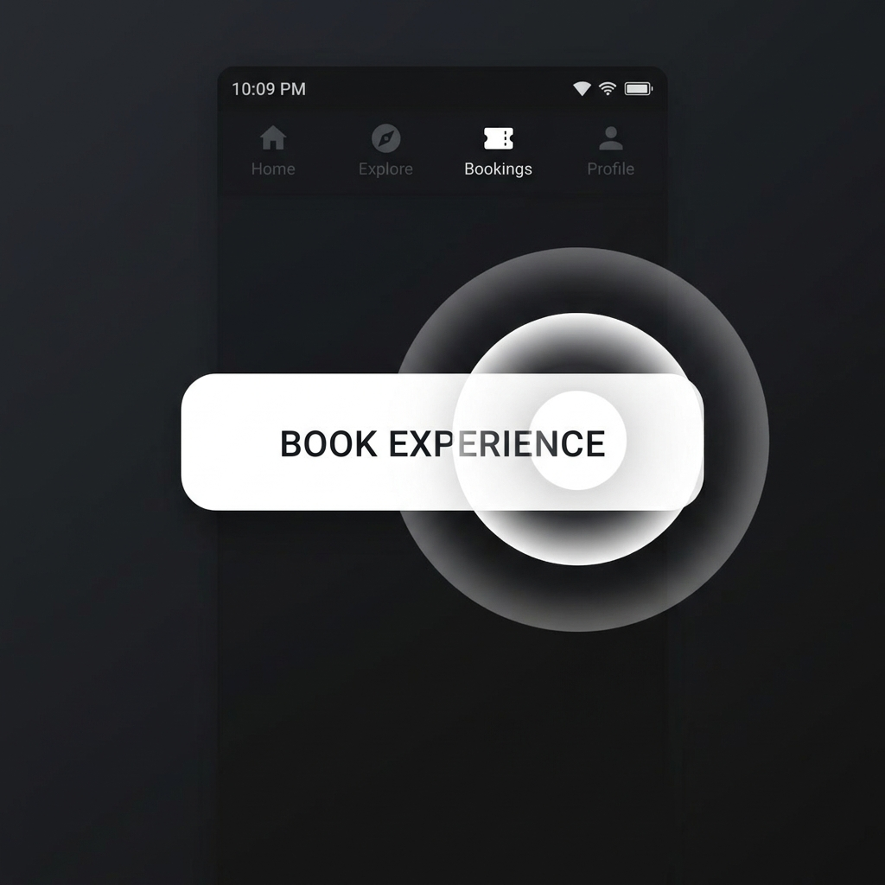

# 11 — Button Ripple Effect

**Category:** Interaction / Micro-animation  
**Complexity:** ⭐ Easy  
**Dependencies:** None — Pure CSS + Vanilla JS

---

## Preview



*A circular wave expands from the exact click point, then fades out.*

---

## What It Is

A **Material Design-inspired ripple** that radiates outward from the exact point you click on a button. The effect:
- Originates at the exact cursor position within the button
- Expands as a circle using `scale(4)` keyframe
- Fades out simultaneously via `opacity: 0`
- Removes itself from the DOM after completion

---

## When To Use

- All primary CTA buttons
- Navigation buttons
- Any clickable element where you want click feedback
- Works on both light and dark buttons

---

## HTML

```html
<!-- Add class "btn-ripple" to any button or link -->
<a href="#" class="btn-ripple cta-button">
  Book Experience
</a>

<button class="btn-ripple secondary-btn">
  Enquire Now
</button>
```

---

## CSS

```css
/* Required: position relative + overflow hidden on the button */
.btn-ripple {
  position: relative;
  overflow: hidden;
  /* your other button styles... */
}

/* The ripple element injected by JS */
.ripple-effect {
  position: absolute;
  border-radius: 50%;
  background: rgba(255, 255, 255, 0.35);  /* white, semi-transparent */
  transform: scale(0);
  animation: ripple-animate 0.55s ease-out forwards;
  pointer-events: none;
}

@keyframes ripple-animate {
  to {
    transform: scale(4);
    opacity: 0;
  }
}
```

---

## JavaScript

```js
function initRipple() {
  document.querySelectorAll('.btn-ripple').forEach(btn => {
    btn.addEventListener('click', e => {
      const rect   = btn.getBoundingClientRect();
      const ripple = document.createElement('span');
      
      // Size: big enough to cover the entire button
      const size   = Math.max(rect.width, rect.height) * 1.5;

      ripple.className = 'ripple-effect';
      ripple.style.cssText = `
        width:  ${size}px;
        height: ${size}px;
        left:   ${e.clientX - rect.left - size/2}px;
        top:    ${e.clientY - rect.top  - size/2}px;
      `;

      btn.appendChild(ripple);

      // Clean up after animation completes
      setTimeout(() => ripple.remove(), 600);
    });
  });
}

initRipple();
```

---

## How It Works

1. On click, get the button's `getBoundingClientRect()`
2. Calculate the click position relative to the button: `e.clientX - rect.left`
3. Create a `<span>` sized `1.5x` the button's largest dimension
4. Center the span on the click point by offsetting by `-size/2`
5. The CSS `@keyframes` scales it from `scale(0)` to `scale(4)` and fades to `opacity: 0`
6. `pointer-events: none` prevents the ripple from intercepting future clicks
7. `setTimeout(600ms)` removes the element after animation ends

---

## Customization

| Property | Where |
|---|---|
| Ripple color | `background: rgba(255,255,255,0.35)` in `.ripple-effect` |
| Speed | Change `0.55s` in `animation` and `600` in `setTimeout` |
| Scale amount | Change `scale(4)` in keyframe |
| Size multiplier | Change `* 1.5` in the JS size calculation |

**Dark ripple on light buttons:**
```css
.ripple-effect { background: rgba(0, 0, 0, 0.15); }
```

**Cyan ripple:**
```css
.ripple-effect { background: rgba(0, 229, 255, 0.3); }
```

---

## Used In
- [EnergyPoint/index.html](../index.html) — All CTA buttons (Book Experience, Enter Center, Schedule Visit)
